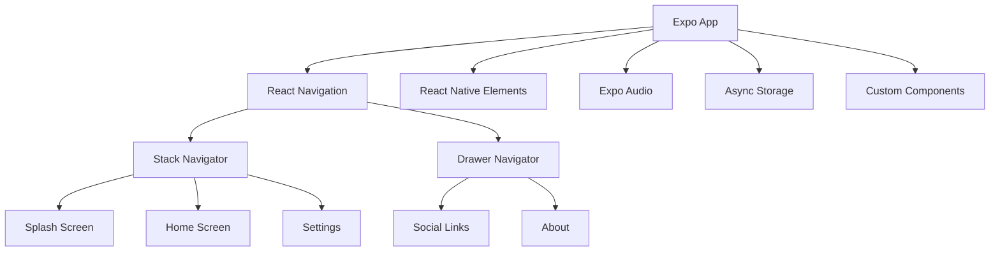
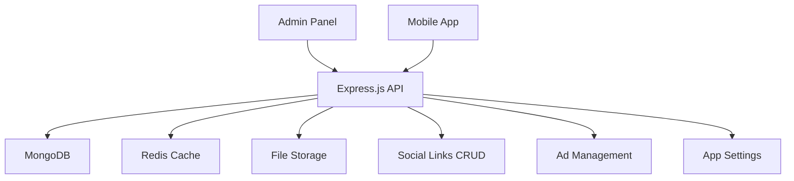

# Enish Radio Pro - Comprehensive Specification Plan

## Executive Summary

This document outlines the complete specification and implementation plan for the Enish Radio Pro mobile application, a cross-platform radio streaming app for Android and iOS featuring a custom backend with admin management capabilities.

## Project Overview

**App Name**: Enish Radio Pro
**Platform**: Android (Google Play Store) & iOS (Apple App Store)  
**Tech Stack**: Expo SDK 54 (React Native)  
**Radio Stream**: Powered by Radioking.io  
**Backend**: Custom Node.js/Express with Admin Panel  

## UI/UX Analysis

Based on the provided mockups:
- **Home Screen**: Features animated player with play/pause controls and metadata display
- **Navigation Drawer**: Clean sidebar navigation for social links and app sections
- **Splash Screen**: Professional welcome screen with brand identity

## Technical Architecture

### Frontend Architecture


### Backend Architecture


## Feature Specification

### 1. Splash Screen
- **Duration**: 2-3 seconds with smooth fade transition
- **Branding**: Display app logo and tagline
- **Loading**: Check user preferences and initialize audio service
- **Navigation**: Auto-redirect to Home Screen

### 2. Home Screen & Audio Player
- **Stream Integration**: 
  - Primary: `https://play.radioking.io/enishradio` (MP3)
  - Fallback: `https://api.radioking.io/radio/771647/listen.m3u` (M3U)
- **Player Controls**:
  - Play/Pause toggle with animated icons
  - Volume control slider
  - Stream quality indicator
- **Metadata Display**:
  - Track title, artist, album art
  - Real-time updates from stream
  - Fallback static information
- **Background Play**: Continuous playback when app is minimized

### 3. Navigation Drawer
- **Social Links Section**: Dynamic links managed via admin panel
- **App Sections**:
  - Home
  - Sleep Timer
  - Settings
  - Privacy Policy
  - Share & Rate
- **Admin Management**: Add/edit/remove social links with icons and URLs

### 4. Sleep Timer
- **Timer Options**: 5, 10, 15, 30, 60 minutes presets
- **Custom Duration**: Manual input option
- **Visual Countdown**: Progress indicator
- **Auto Stop**: Graceful stream termination

### 5. Privacy & Legal
- **Privacy Policy**: Detailed page with scrollable content
- **Data Handling**: Clear explanation of data usage
- **Compliance**: GDPR and App Store guidelines

### 6. Social Features
- **Share App**: Pre-populated message with app link
- **Rate App**: Direct navigation to app stores
- **Social Media**: Links to platforms (Twitter, Facebook, Instagram)

### 7. Ad Management
- **Banner Placement**: Home screen bottom banner
- **Admin Control**: Upload images, set URLs, schedule campaigns
- **Click Tracking**: Monitor engagement metrics

## Technical Implementation Plan

### Phase 1: Project Setup & Configuration
- [ ] Initialize Expo project with SDK 54
- [ ] Configure development environment
- [ ] Set up version control (Git)
- [ ] Install and configure dependencies
- [ ] Create project structure and component library

### Phase 2: Core Audio Functionality
- [ ] Implement Expo Audio module integration
- [ ] Configure stream URLs and fallback logic
- [ ] Develop player controls (play/pause, volume)
- [ ] Implement background play functionality
- [ ] Add metadata parsing and display

### Phase 3: UI/UX Development
- [ ] Create splash screen component
- [ ] Build home screen with animated player
- [ ] Develop navigation drawer interface
- [ ] Implement sleep timer UI/UX
- [ ] Design settings and privacy pages

### Phase 4: Backend Development
- [ ] Set up Node.js/Express server
- [ ] Create MongoDB schema design
- [ ] Implement RESTful API endpoints
- [ ] Develop admin authentication system
- [ ] Build social links management
- [ ] Create ad banner management system

### Phase 5: Admin Panel Development
- [ ] Design admin dashboard UI
- [ ] Implement CRUD operations for social links
- [ ] Build ad management interface
- [ ] Add analytics and reporting
- [ ] Create user management system

### Phase 6: Integration & Testing
- [ ] Connect frontend to backend APIs
- [ ] Implement error handling and retry logic
- [ ] Add offline functionality and caching
- [ ] Conduct comprehensive testing
- [ ] Performance optimization

### Phase 7: App Store Preparation
- [ ] Generate app icons and splash screen assets
- [ ] Create app store screenshots
- [ ] Write app descriptions and metadata
- [ ] Configure app store listings
- [ ] Final testing and bug fixes

## Technology Stack

### Frontend (Expo/React Native)
- **Core**: React Native 0.74+, Expo SDK 54
- **Navigation**: React Navigation 6.x
- **UI Components**: React Native Elements, NativeBase
- **Audio**: Expo Audio
- **State Management**: React Context + Redux Toolkit
- **Storage**: AsyncStorage
- **HTTP Client**: Axios
- **Animations**: React Native Reanimated 3

### Backend
- **Runtime**: Node.js 20+
- **Framework**: Express.js
- **Database**: MongoDB with Mongoose
- **Cache**: Redis
- **Authentication**: JWT + Passport
- **File Storage**: AWS S3 or Cloudinary
- **Admin UI**: React Admin or custom dashboard

### Development Tools
- **IDE**: VS Code with React Native extensions
- **Version Control**: Git with GitHub
- **CI/CD**: GitHub Actions or Expo EAS Build
- **Testing**: Jest, React Testing Library
- **Monitoring**: Sentry for error tracking

## API Specification

### Social Links API
```
GET /api/social-links     # Get all social links
POST /api/social-links    # Create new social link
PUT /api/social-links/:id # Update social link
DELETE /api/social-links/:id # Delete social link
```

### Ad Banners API
```
GET /api/ads             # Get active banners
POST /api/ads           # Create new ad campaign
PUT /api/ads/:id        # Update ad campaign
DELETE /api/ads/:id     # Delete ad campaign
```

### Stream Metadata API
```
GET /api/stream/metadata # Get current track info
```

## Security Considerations

- **HTTPS**: All API communications encrypted
- **Authentication**: JWT tokens for admin access
- **Input Validation**: Sanitize all user inputs
- **Rate Limiting**: Prevent API abuse
- **CORS**: Properly configured for mobile apps

## Performance Optimization

- **Audio Streaming**: Efficient buffer management
- **Image Loading**: Lazy loading for album art
- **Caching**: Redis for frequently accessed data
- **Bundle Size**: Optimize for fast app startup
- **Memory Management**: Prevent audio memory leaks

## Testing Strategy

- **Unit Tests**: Core functionality and utilities
- **Integration Tests**: API endpoints and database operations
- **E2E Tests**: Critical user journeys
- **Manual Testing**: UI/UX validation on devices
- **Performance Tests**: Audio streaming and memory usage

## Deployment Plan

### Backend Deployment
- **Platform**: AWS EC2 or DigitalOcean
- **Database**: MongoDB Atlas
- **Cache**: Redis Cloud
- **Monitoring**: PM2 with logging

### Mobile App Deployment
- **Build Process**: Expo EAS Build
- **Testing**: Internal testing with TestFlight/Play Console
- **Release**: Staged rollout to production
- **Updates**: Over-the-air updates via Expo

## Timeline & Milestones

- **Week 1-2**: Project setup and environment configuration
- **Week 3-4**: Core audio functionality development
- **Week 5-6**: UI/UX implementation
- **Week 7-8**: Backend API development
- **Week 9-10**: Admin panel development
- **Week 11**: Integration and testing
- **Week 12**: App store preparation and launch

## Success Criteria

- ✅ Smooth audio streaming with minimal buffering
- ✅ Intuitive user interface matching mockups
- ✅ Admin panel fully functional for content management
- ✅ App store approval and successful deployment
- ✅ Positive user feedback and engagement metrics

---

*This specification plan provides a comprehensive roadmap for developing the Enish Radio Pro mobile application with all requested features and a custom backend management system.*